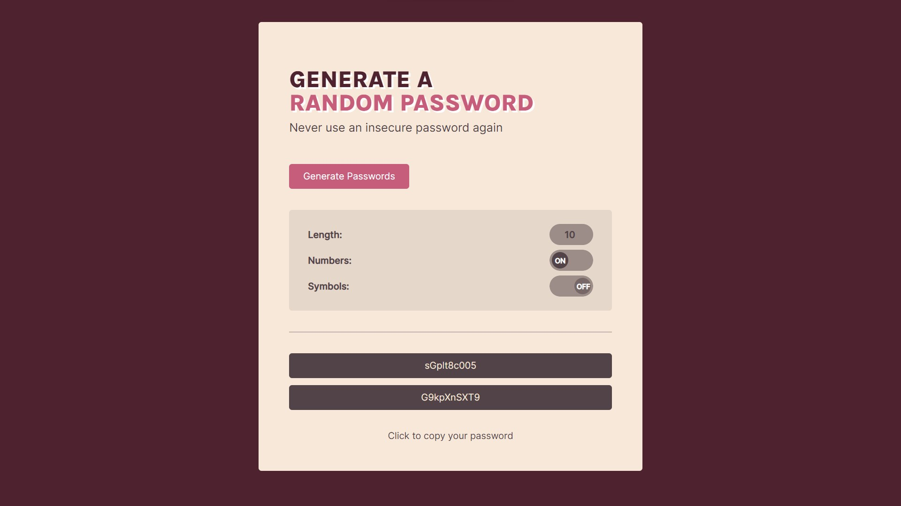

# Scrimba Solo Project - Password Generator Web App

Hello everyone 👋🏼,

This is my solo project for Password Generator.

The challenge is to generate two random passwords when the user clicks the button.

I tried to complete all the additional challenges, like the ability to set password length, toggle "symbols" and "numbers", and copy-on-click. Finally, I'm super happy with my result. 😊

Check out my code [scrim Password Generator](https://scrimba.com/scrim/cobb34528acdebba67b54dbdc)

Live: https://gretali.github.io/Password-generator

Repo: https://github.com/GretaLi/Password-generator

## Password Generator Web App



### The challenge

- Generate two random passwords when the user clicks button
- Each password should be 15 characters long
- Ability to set password length passwordLength (additional)
- Add copy-on-click (additional)
- Toggle "simbols" and "numbers" on/off (additional)

### Built with

- Semantic HTML5 markup
- CSS custom properties
- Flexbox
- Mobile-first workflow
- Vanilla Javascript

### What I learned

**{ Generate Password Function }**

_Before refactoring JS_

My first attempt to generate passwords was like the one below, I repeated creating random indexes two times for two passwords.
I started to think about what if there are 10 passwords, will I repeat it 10 times?

```js
let passwordOne = "";
let passwordTwo = "";

for (let i = 0; i < passwordLength; i++) {
  passwordOneIndex = Math.floor(Math.random() * characters.length);
  passwordTwoIndex = Math.floor(Math.random() * characters.length);
  passwordOne += characters[passwordOneIndex];
  passwordTwo += characters[passwordTwoIndex];
}
passwordOneEl.textContent = passwordOne;
passwordTwoEl.textContent = passwordTwo;
```

_After refactoring JS_

So I declared a single `generatePassword()` function, and two variables `passwordOne` and `passwordTwo` to catch the returned value.

```js
const passwordOneEl = document.querySelector("#password-one-el");
const passwordTwoEl = document.querySelector("#password-two-el");
const inputLength = document.querySelector("#input-length");

function generateTwoPasswords() {
  // get the password length from the value of input number
  let passwordLength = inputLength.value;

  // create variables to get the values that functions return
  let characters = createCharacters();
  let passwordOne = generatePassword();
  let passwordTwo = generatePassword();

  function generatePassword() {
    let password = "";
    for (let i = 0; i < passwordLength; i++) {
      let passwordIndex = Math.floor(Math.random() * characters.length);
      password += characters[passwordIndex];
    }
    return password;
  }

  passwordOneEl.textContent = passwordOne;
  passwordTwoEl.textContent = passwordTwo;
  return;
}
```

```html
<button onclick="generateTwoPasswords()">Generate Passwords</button>
...
<input id="input-length" type="number" value="15" />
```

**{ Create Character Array Function }**

Firstly, I separated the character array provided by Per in the [scrim](https://scrimba.com/learn/frontend/solo-project-password-generator-cR9B46Sg) into three categories - `alphabets`, `numbers` & `symbols`.
Then declared `characters` as an empty array to be ready to store requested character strings.

Following, I used `Spread syntax(...)` to clone the `alphabets` arry into `characters` and then combine the requested category into the previous one.

`Spread syntax(...)`, which is adding three "." before array, allows us to clone only strings or numbers in the old array into a new one, instead of adding the entire array.

This technique I learned from another awesome [YouTube Course](https://youtu.be/NIq3qLaHCIs?t=185) and this is my first time using it in real project.

```js
// three categories
const alphabets = ["A","B","C","D","E","F","G","H","I","J","K","L","M","N","O","P","Q","R","S","T","U","V","W","X","Y","Z","a","b","c","d","e","f","g","h","i","j","k","l","m","n","o","p","q","r","s","t","u","v","w","x","y","z"]; // prettier-ignore
const numbers = ["0", "1", "2", "3", "4", "5", "6", "7", "8", "9"];
const symbols = ["~","`","!","@","#","$","%","^","&","*","(",")","_","-","+","=","{","[","}","]",",","|",":",";","<",">",".","?", "/"]; // prettier-ignore

let characters = [];

function createCharacters() {
  // use spread styrax(...) to add alphabets string into new array by defult
  characters = [...alphabets];

  // if toggleNumbers is true,
  // then combine charaters arr and numbers arr by using spread syntax(...)
  if (toggleNumbers) {
    characters = [...characters, ...numbers];
  }
  if (toggleSybols) {
    characters = [...characters, ...symbols];
  }
  return characters;
}
```

P.S. If you're curious about how I code my toggle function, please check line 26 - 41 of my js file. 🙂

**{ Click to Copy Function }**

To copy text to clipboard, I use `navigator.clipboard.writeText(text).then(function())` which I found the solution [here](https://stackoverflow.com/questions/45071353/copy-text-string-on-click).

Here I use `setTimeout(function, delay)`, a sibling method of `setInterval()` that I learned from my [previous project](https://github.com/GretaLi/Scoreboard-web-app), to assign the previous text after 2.5s from the click.

```js
const noteEl = document.querySelector("#note-el");
function copy(that) {
  navigator.clipboard.writeText(that.textContent).then(function () {
    // notify the user when clipboard successfully set
    noteEl.textContent = "Password copied to clipboard";
    noteEl.classList.add("active");
  });

  // after 2.5s from the click, assign the defualt text
  setTimeout(function () {
    noteEl.textContent = "Click to copy your password";
    noteEl.classList.remove("active");
  }, 2500);
}
```

- The `setTimeout()` method calls a function after a number of milliseconds.
- Difference between `setTimeout()` and `setInterval()`
  - `setTimeout()` calls a function only one time.
  - `setInterval()` calls a function at specified intervals. That means it repeats the function every requested seconds.

---

I remember at the beginning of my coding journey, I refused to COPY code from the internet.
I felt so guilty as copy-and-paste was like cheating behavior for me.

Day by day, I realized that there is no ending line for this learning process, to make my learning more efficient, I started to get some inspiration from [Codepen](https://codepen.io/) and [Stack Overflow](https://stackoverflow.com/) to see how people solve their problems. As Per said, it's super normal, even a real developer googles code answers in daily life.

So, never be shamed to copy code from the internet (this is for telling myself), as long as I'm following the below principles: from COPY to LEARN

- Try to understand every line of code that I copy
- Maintain my own coding style. Don't forget to change the class name or id, for JS variable, parameter, and function name.
- Shout out to the original, if it is from other people's creations. (Codepen for example)

Thanks for reading my document! ✨

Happy coding, happy life, Cheers! 💫

---

### Resources

- [Scrimba | The Frontend Developer Career Path](https://scrimba.com/learn/frontend/)

- [JavaScript Tutorial | Spread Operator](https://www.javascripttutorial.net/es6/javascript-spread/)

- [Web Dev Simplified YouTube| Spread combaining](https://youtu.be/NIq3qLaHCIs?t=185)

- [Codepen | Pure CSS Toggle Buttons](https://codepen.io/himalayasingh/pen/EdVzNL)
